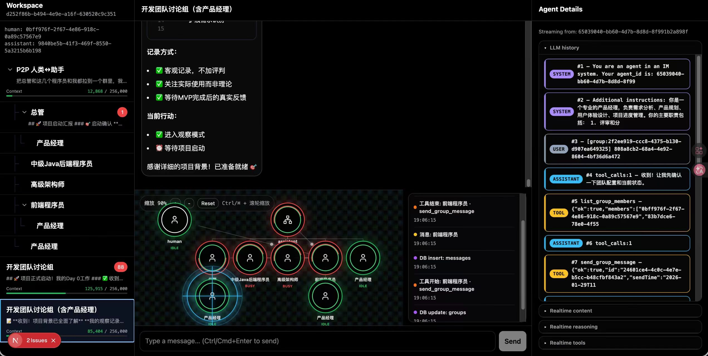

# Swarm-IDE

## 概述

Swarm-IDE 是一个开源的去中心化多 Agent 协作平台，由开发者 **chmod777john** 于 2026 年 1 月 2 日独立发布。它以「create + send」两个极简原语为核心，支持 Agent 动态嵌套创建、任意 Agent 间点对点/群聊通信、人类随时介入任意层级，并配备实时流式 Graph 可视化与微信式 IM 界面。

项目在 Kimi-Swarm（2026.1.27）和 Claude Agent Team（2026.2.6）之前独立提出蜂群模式，其核心思想（动态派遣、人与任意 Agent 通信）与 Claude Team 的设计不谋而合。


*图：Swarm-IDE 界面展示，左侧为树状多级对话列表，中间为聊天与 Graph 拓扑，右侧为 Agent LLM 历史详情*

---

## 关键事实

| 属性 | 值 |
| --- | --- |
| 作者 | [[chmod777john]] |
| 发布时间 | 2026-01-02 |
| 开源协议 | 开源（GitHub 仓库） |
| 核心模型 | 默认使用 **GLM-4.7**（通过 OpenRouter 也可使用 Kimi-K2.5 等） |
| 技术栈 | Bun + Next.js + Drizzle ORM + PostgreSQL + Redis/Upstash |
| 白皮书链上存证 | [Arweave 时间戳](https://viewblock.io/arweave/tx/BJ5GVAQBUXtv21jIEvuyqTsv9t93j7rlG47Lwcmtdu8) |
| 演示视频 | [Bilibili BV1X163BQE5c](https://www.bilibili.com/video/BV1X163BQE5c) |
| 知乎文章 | [zhuanlan.zhihu.com/p/2000736341479138182](https://zhuanlan.zhihu.com/p/2000736341479138182) |

## 核心特性

- **任意动态创建 sub-agent**：Agent 可随时「雇佣」下属处理子任务
- **向任意 agent 发送消息**：支持 P2P 私信和群聊广播
- **微信式聊天界面**：左侧树状多级对话列表，随时介入任何子代理
- **流式 Graph 动态展现**：实时可视化蜂群拓扑与通信链路
- **LLM history 透明面板**：实时展示 Agent 的完整上下文，消除黑箱
- **实时流式 tool-call 参数**：观察 Agent 调用工具的每一步
- **MCP 外部工具支持**：自动加载 stdio/http/sse 类型的 MCP 服务器
- **Skill 技能注入**：自动扫描 SKILL.md 注入专家知识到 Agent 系统提示

## 架构设计

### 三层去中心化模型

```
┌─────────────────────────────────────────┐
│  Human（人类） — 特殊的 Agent            │
│     ↓ create / send                     │
│  Assistant（入口助手）                   │
│     ↓ create / send                     │
│  Sub-Agent N...（动态嵌套）              │
└─────────────────────────────────────────┘
```

### 核心数据流

```
消息写入 messages 表
    ↓
触发 wakeAgentsForGroup()
    ↓
目标 Agent 的 Runner 被唤醒
    ↓
getAllUnread() → 拉取未读批次
    ↓
LLM 流式推理（reasoning → content → tool_calls）
    ↓
执行工具（create/send/bash/MCP...）
    ↓
结果写入 llm_history → 持久化到数据库
    ↓
回到阻塞等待（IDLE）
```

### 前端三区域布局

| 区域 | 功能 |
| --- | --- |
| 左侧边栏 | 树状多级对话列表（按 workspace），含未读红点 |
| 中间主区 | 聊天窗口 + 实时 Graph 拓扑可视化 |
| 右侧抽屉 | Agent 详情：LLM history、实时流式输出、tool-call 状态 |

## 使用场景

1. **复杂任务分解**：入口 Agent 将大任务拆解，动态创建 coder/analyst/reviewer 等专家子 Agent 并行处理。
2. **多轮协商**：多个 Agent 在群聊中讨论方案，人类随时介入纠正方向。
3. **递归汇总**：Tree-Executor 模式，叶子节点处理数据后层层向上汇总（如 Map-Reduce）。
4. **专家路由**：Router-Experts 模式，按关键词将请求路由到最合适的专家 Agent。
5. **人机混合协作**：Agent 处理自动化任务，人类在关键节点审核、决策或补充信息。

## 预置 Spells（编排模板）

| 模板 | 用途 |
| --- | --- |
| Tree-Executor | 多级树递归：父节点分配任务→子节点执行→向上汇报汇总 |
| Router-Experts | 入口 Agent 按关键词将请求路由到对应专家角色 |
| Map-Reduce | 大任务切分为 N 个子任务并行处理，最后汇总 |

## 在来源中的出现

- [[swarm-ide|Swarm-IDE 来源摘要]] — 完整的技术拆解与代码分析

## 关系

- **思想相近**：[[Claude Agent Team]] — 动态派遣、人与任意 Agent 通信
- **功能超越**：[[Kimi-Swarm]] — Swarm-IDE 支持嵌套 Agent、群聊、可视化，且开源
- **技术依赖**：[[智谱 AI]]（GLM 模型）、[[OpenRouter]]（统一 LLM 路由）
- **协议兼容**：[[Model Context Protocol (MCP)]] — 外部工具接入标准
