# 面向 AI 服务全生命周期的零成本代理 NAS 驱动协同部署优化

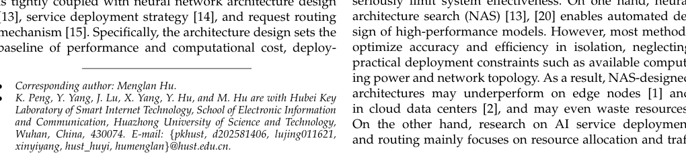

- 作者：Kai Peng, Yue Yang, Jing Lu, Xinyi Yang, Yi Hu, and Menglan Hu
- 学校：华中科技大学（Huazhong University of Science and Technology）
- 关键词：neural architecture search; zero-cost proxy; AI service; full-lifecycle optimization; dynamic deployment
- DOI / 论文链接：（未提供 DOI）

## 1. 研究背景、问题定义与核心思路

### 1.1 研究动机与关键挑战

随着 AI 服务在智能制造、智慧医疗和自动驾驶等场景的广泛部署，微服务架构已成为主流。然而，传统"软件即服务"（SaaS）模式难以满足个性化性能优化、低延迟响应和动态资源调度的刚性需求。

本文指出当前 AI 服务全生命周期管理面临的三大核心挑战：

1. **设计-部署脱节**：传统 NAS 方法仅优化精度与效率，忽视可用算力和网络拓扑等实际部署约束，导致搜索出的架构在边缘节点或云数据中心表现不佳甚至浪费资源。
2. **代理指标偏离部署需求**：现有零成本代理依赖梯度、复杂度等通用指标，难以捕捉面向部署的架构特征。
3. **动态协作缺失**：当前研究仅在运行时调整容器或虚拟机，缺乏架构级别的动态优化和替换机制，打破了从架构设计到动态部署执行的协同链路。

### 1.2 方法框架与核心思路

本文提出 **GSTC-JCQDA-LAMRA** 端到端协同优化框架，实现"零成本评估 → 静态部署 → 动态调整"的全生命周期闭环：

- **GSTC（零成本代理模型）**：基于信息量化的编码机制，从四个维度评估架构性能和部署需求，无需任何训练。
- **JCQDA（联合通信与队列感知部署算法）**：基于 M/M/C 排队模型刻画通信、排队和处理延迟，通过服务-服务器亲和机制平衡通信延迟与排队延迟。
- **LAMRA（负载感知模型替换算法）**：实时监控负载波动，从 GSTC 预评估架构库中选择合适架构，同步更新 JCQDA 部署方案。

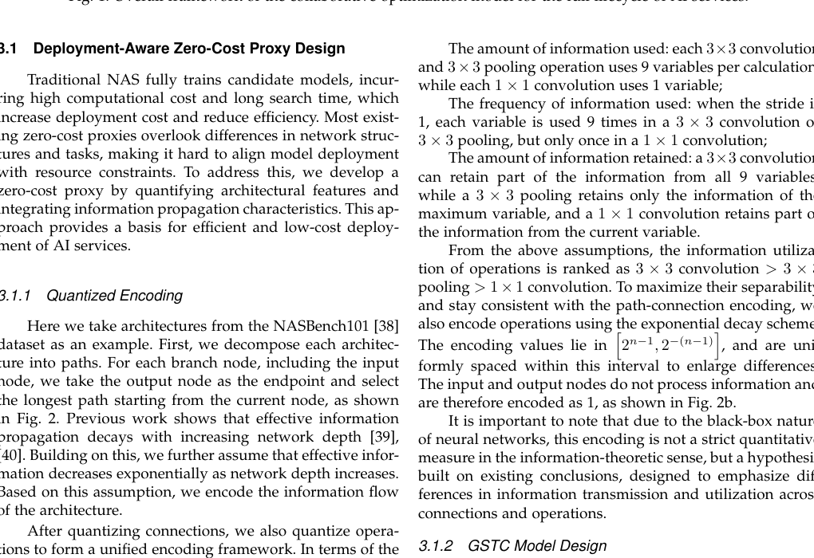
*图 1：AI 服务全生命周期协同优化模型的整体框架*

上图展示了三层架构：用户访问层接收请求并转发至计算层；计算层由服务器集群组成，独立执行 JCQDA 部署策略和 LAMRA 动态替换；模型设计层使用 GSTC 构建满足服务需求的 AI 模型，并接收用户访问层的实时反馈以调整架构。

### 1.3 主要创新点

1. **首次实现架构设计-部署路由-动态调整的全生命周期协同优化**，填补了 NAS 与部署需求之间的长期割裂。
2. **提出 GSTC 信息量化的量化编码机制**，超越传统通用代理，从总路径信息量（G）、路径信息变异（S）、输出节点总信息量（T）和输出节点信息变异（C）四个维度评估架构，无需训练即可预测性能。
3. **JCQDA 引入服务-服务器亲和机制**，在 M/M/C 排队理论框架下联合优化通信延迟和排队延迟，建立"设计-部署"闭环。
4. **LAMRA 实现负载感知的动态模型替换**，结合 Pareto 前沿选择和加权评分，在有限硬件资源下适应负载变化，与 JCQDA 静态部署形成互补。

---

## 2. 核心方法与技术主线解析

### 2.1 GSTC 零成本代理模型

GSTC 的核心思想是将神经架构的信息传播特性量化为四个维度，通过 min-max 归一化后加权求和得到代理分数。

#### 2.1.1 信息量化的编码机制

论文假设有效信息随网络深度指数衰减，并基于信息使用量、使用频率和保留量对不同操作进行编码：

- $3\times3$ 卷积/池化：每次计算使用 9 个变量，保留更多信息
- $1\times1$ 卷积：每次计算使用 1 个变量，保留较少信息

编码值落在区间 $\left[2^{-(n-1)}, 2^{n-1}\right]$ 内，均匀分布以放大差异。输入和输出节点编码为 1。

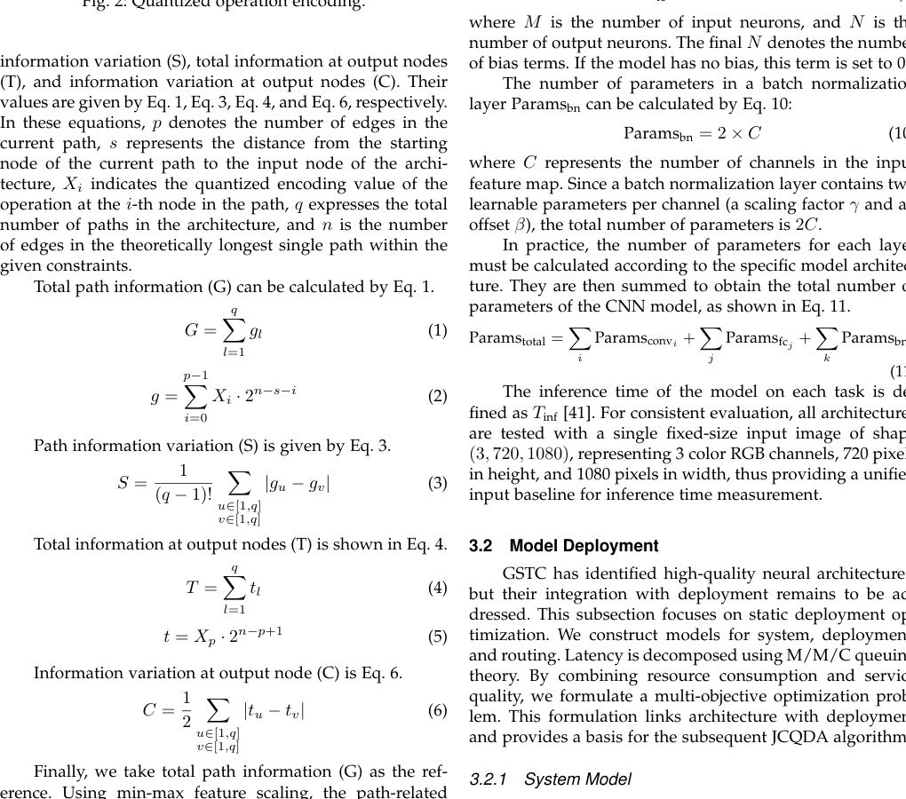
*图 2：量化操作编码*

#### 2.1.2 GSTC 四维度模型设计

基于量化编码，论文定义四个核心变量：

**总路径信息量 $G$**：

$$
G = \sum_{l=1}^{q} g_l \quad \text{其中} \quad g = \sum_{i=0}^{p-1} X_i \cdot 2^{n-s-i}
$$

其中 $p$ 为当前路径边数，$s$ 为路径起点到输入节点的距离，$X_i$ 为路径上第 $i$ 个节点的量化编码，$q$ 为架构总路径数，$n$ 为理论最长路径边数。

**路径信息变异 $S$**：

$$
S = \frac{1}{(q-1)!} \sum_{u\in[1,q]} \sum_{v\in[1,q]} |g_u - g_v|
$$

**输出节点总信息量 $T$**：

$$
T = \sum_{l=1}^{q} t_l \quad \text{其中} \quad t = X_p \cdot 2^{n-p+1}
$$

**输出节点信息变异 $C$**：

$$
C = \frac{1}{2} \sum_{u\in[1,q]} \sum_{v\in[1,q]} |t_u - t_v|
$$

最终 GSTC 代理分数为：

$$
\text{GSTC} = G + S + \frac{G_{\max} - G_{\min}}{T_{\max} - T_{\min}} \cdot T + \frac{G_{\max} - G_{\min}}{C_{\max} - C_{\min}} \cdot C
$$

此公式将路径相关变量与输出节点相关变量分别归一化后融合，使 GSTC 能同时捕获架构的结构特征和任务适应性。

### 2.2 系统部署模型（M/M/C 排队框架）

#### 2.2.1 服务速率与部署约束

设微服务 $m$ 的版本 $k$ 的推理时间为 $T_{m,k}^{\inf}$，则单实例服务速率为：

$$
\mu_{m,k} = \frac{1}{T_{m,k}^{\inf}}
$$

部署变量 $N_m^v$ 表示服务 $m$ 在服务器 $v$ 上的实例数，需满足：

$$
\sum_{m\in M} N_m^v \leq C^{\text{CPU}}, \quad \sum_{m\in M} N_m^v C_m^{\text{GPU}} \leq C^{\text{GPU}}, \quad \forall v \in V
$$

其中 $C^{\text{CPU}}$ 和 $C^{\text{GPU}}$ 分别为服务器的 CPU 核心数和 GPU 内存容量。

#### 2.2.2 端到端延迟分解（M/M/C 排队模型）

基于 Burke 定理和泊松流的线性可加性，系统采用 M/M/C 排队模型刻画服务动态行为。服务 $m$ 在服务器 $v$ 上的总驻留延迟为：

$$
t_m^s = W_m^q + \frac{1}{\mu_m}
$$

其中平均排队延迟 $W_m^q$ 由 M/M/C 稳态分析导出：

$$
W_m^q = \frac{L_m^q}{\lambda_m^v}, \quad L_m^q = \frac{(\lambda_m^v/\mu_m)^{N_m^v} \cdot \rho_m^v}{N_m^v! \cdot (1-\rho_m^v)^2} \cdot P_0
$$

其中服务强度 $\rho_m^v = \frac{\lambda_m^v}{N_m^v \mu_m} < 1$（稳定性条件），$P_0$ 为系统空闲概率。

跨服务器通信延迟为：

$$
t_{m_i,m_j}^{\text{tran}} = \frac{\text{data}(m_i, m_j)}{B_{v_a,v_b}}
$$

请求 $r$ 的端到端延迟为处理延迟与跨服务器通信延迟之和：

$$
T_r = \sum_{i=1}^{|M_r|} t_{m_i}^s + \sum_{i=1}^{|M_r|-1} t_{m_i,m_{i+1}}^{\text{tran}}
$$

#### 2.2.3 多目标优化问题

以最小化总资源消耗和最大化综合 QoS 为目标：

$$
\min C_{\text{total}} = \sum_{v\in V} \sum_{m\in M} N_m^v C_m^{\text{GPU}}, \quad \max Q_{\text{sys}} = \frac{\sum_{r\in R} \lambda_r Q_r}{\sum_{r\in R} \lambda_r}
$$

其中综合 QoS $Q_r = \alpha Q_r^{\text{perf}} - (1-\alpha)\frac{T_r}{T_{\max}}$，$\alpha \in [0,1]$ 平衡性能与延迟。

采用加权和方法转化为单目标问题：

$$
\max \beta Q_{\text{sys}} - (1-\beta)\frac{C_{\text{total}}}{C_{\max}}
$$

### 2.3 JCQDA 部署算法

JCQDA 解决静态部署中的 NP-hard 问题，核心设计包括：

**最小实例数计算**：基于 M/M/C 稳定性条件 $\rho_m^v < 1$，引入松弛因子 $\theta \geq 0$ 吸收突发流量：

$$
N_m = \left\lceil (1+\theta)\frac{\lambda_m}{\mu_m} \right\rceil
$$

**服务-服务器亲和度**：平衡同服务集中部署（降低排队延迟）与依赖服务共置（降低通信延迟）之间的冲突：

$$
A_m^v = \alpha \cdot \text{Avail}_m^v + \beta \cdot \text{PS}_m^v
$$

其中 $\text{Avail}_m^v$ 为服务器 $v$ 上仍可部署的服务 $m$ 实例数，$\text{PS}_m^v$ 为 $v$ 上已部署的依赖服务实例数。

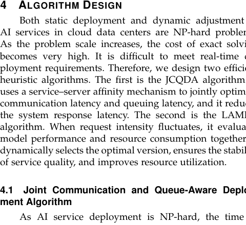
*算法 1：联合通信与队列感知部署算法（JCQDA）*

JCQDA 首先按 $N_m$ 降序排列所有服务，然后为每个服务计算所有服务器的亲和度并按降序排列，最后在资源允许的情况下逐服务器放置实例。此贪心策略的时间复杂度远低于精确求解，满足实时部署需求。

### 2.4 LAMRA 动态替换算法

LAMRA 应对动态负载波动，包含三个步骤：

1. **推理速度阈值筛选**：当请求强度变化超过阈值时，根据当前部署实例数和实时系统负载计算满足目标 QoS 的最小推理速度，筛除不满足的版本。
2. **Pareto 前沿选择**：对剩余版本按服务速率、服务效率和 GPU 内存消耗进行 Pareto 最优筛选，保留多指标均不被支配的版本。
3. **加权评分替换**：对候选版本计算综合评分：

$$
\text{score}_{m,k} = \alpha \mu_{m,k} + \beta \cdot \text{GSTC}_{m,k} + \gamma C_{m,k}^{\text{GPU}}
$$

选择评分最高的版本替换当前部署版本。

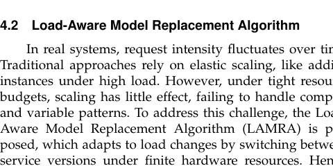
*算法 2：负载感知模型替换算法（LAMRA）*

LAMRA 的关键在于 GSTC 预评估架构库的存在使得版本选择无需训练，结合 JCQDA 的部署参数同步更新，避免了模型替换带来的部署不当延迟问题。

### 2.5 理论分析：性能边界与对偶间隙

论文的理论证明基于三条核心假设（如上图所示）：
1. **GSTC 相关性优势**：GSTC 分数与真实性能的相关性严格优于 FLOPs 和 Params（$\tau_{\text{GSTC},P} > \tau_{\text{FLOPs},P}$ 且 $\tau_{\text{GSTC},P} > \tau_{\text{Params},P}$）
2. **相关性-性能映射**：更高的 $\tau$ 意味着所选架构更好地匹配"高性能低资源"目标，即 $C_m^{\text{GPU}}$ 趋于减小，$\mu_m$ 趋于增大
3. **Slater 条件满足**：联合优化问题存在严格可行解，保证强对偶定理适用，凸规划的对偶间隙为零

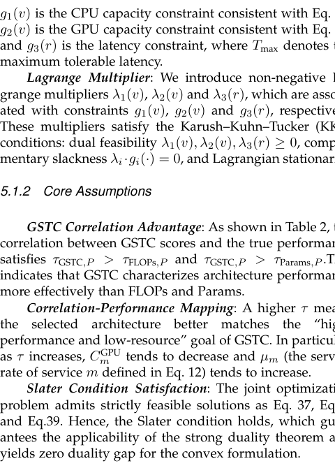
*核心假设：GSTC 相关性优势、相关性-性能映射、Slater 条件满足*

#### 2.5.1 Theorem 1：资源利用率上界

**假设**：GSTC 筛选的架构比基线具有更小的单实例 GPU 内存消耗（$\text{GPU}_{\text{GSTC}} < \text{GPU}_0$）和更高的部署冗余系数（$\gamma_{\text{GSTC}} > \gamma_0$）。

**结论**：联合优化具有更高的资源利用率上界。

$$\bar{\eta}^* > \bar{\eta}_0^*$$

其中 $\bar{\eta}^*$ 和 $\bar{\eta}_0^*$ 分别为联合优化和基线在最优解处的平均资源利用率。核心原因在于 GSTC 架构的低 GPU 消耗使得同等资源约束下可部署更多实例，且冗余系数更高意味着更稳定的资源利用。

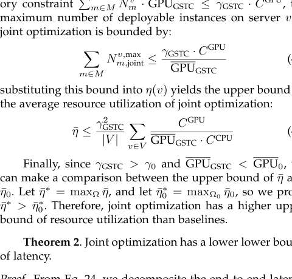
*定理 2：联合优化具有更低的延迟下界*

#### 2.5.2 Theorem 2：延迟下界

**证明思路**：将端到端延迟分解为计算延迟、排队延迟和通信延迟三部分：

$$T_r = T_r^{\text{comp}} + T_r^{\text{que}} + T_r^{\text{comm}}$$

- **计算延迟**：由于 $\mu_{m,0} < \mu_{m,\text{GSTC}}$，故 $T_{r,0}^{\text{comp}} > T_{r,\text{joint}}^{\text{comp}}$
- **排队延迟**：GSTC 架构可部署更多实例，服务强度更低，故 $T_{r,0}^{\text{que}} > T_{r,\text{joint}}^{\text{que}}$
- **通信延迟**：JCQDA 的服务-服务器亲和机制使更多依赖服务共置于同一服务器，故 $T_{r,0}^{\text{comm}} > T_{r,\text{joint}}^{\text{comm}}$

综合得 $T_{\min,\text{joint}} < T_{\min,0}$，即联合优化严格优于基线。

#### 2.5.3 Theorem 3：服务质量上界

**结论**：联合优化具有更高的服务质量上界。

$$Q_{\text{sys}}^* > Q_{\text{sys},0}^*$$

由于 GSTC 架构具有更高的任务性能（$Q_{r,0}^{\text{perf}} < Q_{r,\text{GSTC}}^{\text{perf}}$）且 Theorem 2 已证明 $T_{r,0} > T_{r,\text{joint}}$，代入 QoS 定义式 $Q_r = \alpha Q_r^{\text{perf}} - (1-\alpha)\frac{T_r}{T_{\max}}$ 可直接得证。

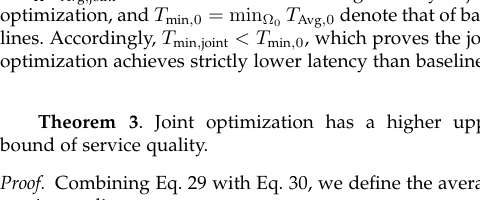
*定理 3：联合优化具有更高的服务质量上界*

#### 2.5.4 对偶间隙分析

论文进一步通过拉格朗日对偶分析证明：由于 GSTC 筛选的架构具有更小 GPU 消耗和更高服务速率，联合优化的 KKT 乘子 $\lambda_1(v), \lambda_2(v)$ 更小，可行域更宽松，对偶间隙更窄，实际性能更接近理论最优。而基线因固定架构的高 GPU 消耗和低服务速率，可行域收缩，KKT 乘子更大，对偶间隙更宽。

---

## 3. 仿真结果与对比分析

### 3.1 代理模型验证结果

论文在 NAS-Bench-101、NAS-Bench-201 和 TransNAS-Bench-101 三个搜索空间上对比了 GSTC 与经典代理（Grad norm、SNIP、GraSP、Fisher、Synflow、Zen-score）以及传统指标（FLOPs、#Params）。

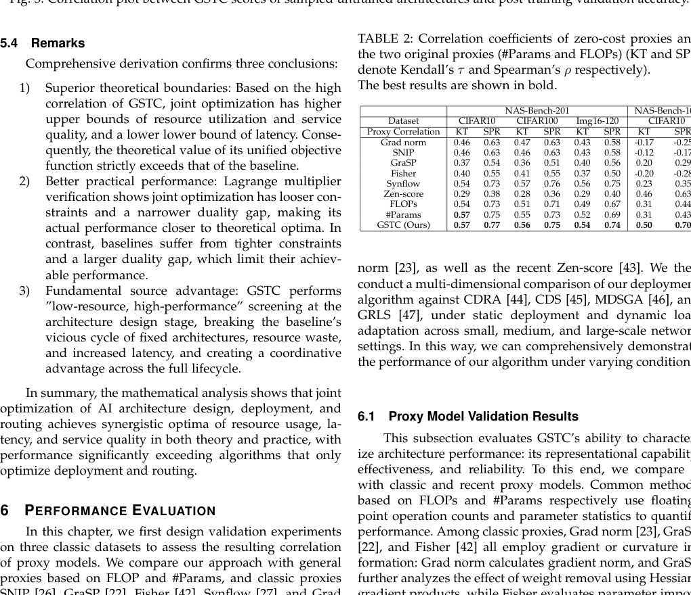
*图 3：GSTC 分数与采样未训练架构的后训练验证准确率之间的相关性散点图*

上图展示了 8 个工业 AI 服务场景（CIFAR10、ImageNet16-120、目标分类、场景分类、语义分割、房间布局、表面法线、拼图）中 GSTC 分数与验证准确率的相关性。在 TransNAS-Bench-101 上，Scene Classification 的 Kendall's $\tau = 0.549$，Surface Normal 的 $\tau = 0.589$，表明 GSTC 在跨任务场景中仍保持强相关性。

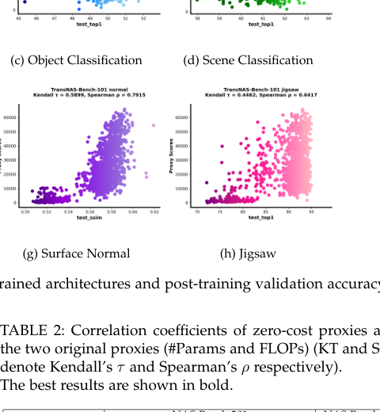
*表 2：零成本代理与原始代理（#Params 和 FLOPs）的相关性系数对比*

表 2 显示，在 NAS-Bench-201（CIFAR-10）上，GSTC 的 Spearman's $\rho = 0.77$，高于 Synflow（0.73）和 #Params（0.75）；在 NAS-Bench-101（CIFAR-10）上，GSTC 的 Kendall's $\tau = 0.50$、$\rho = 0.70$，远超 FLOPs（0.31, 0.44），且避免了 Grad norm 的负相关。这一优势源于 GSTC 基于信息量的编码设计和四维评估体系，能够同时捕获结构特征和任务适应性。

### 3.2 部署模型验证结果

论文将 JCQDA/LAMRA 与四个基线（CDRA、CDS、MDSGA、GRLS）在平均端到端延迟、服务准确率和 GPU 内存消耗三个指标上进行对比。

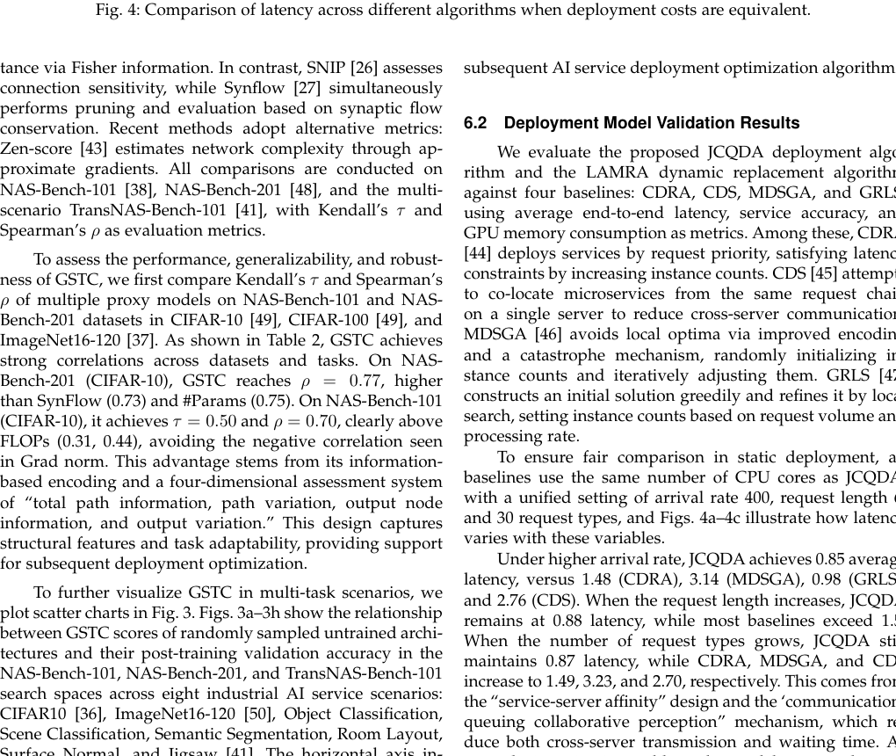
*图 4：部署成本相同时不同算法的延迟对比*

在静态部署中（图 4），当到达率为 400、请求链长度为 6、请求类型数为 30 时：
- **到达率增加**：JCQDA 平均延迟 0.85，对比 CDRA（1.48）、MDSGA（3.14）、GRLS（0.98）、CDS（2.76）
- **请求链长度增加**：JCQDA 保持 0.88，多数基线超过 1.5
- **请求类型数增加**：JCQDA 保持 0.87，CDRA/MDSGA/CDS 分别增至 1.49/3.23/2.70

这得益于"服务-服务器亲和"设计和"通信-排队协同感知"机制，同时降低了跨服务器传输和等待时间。

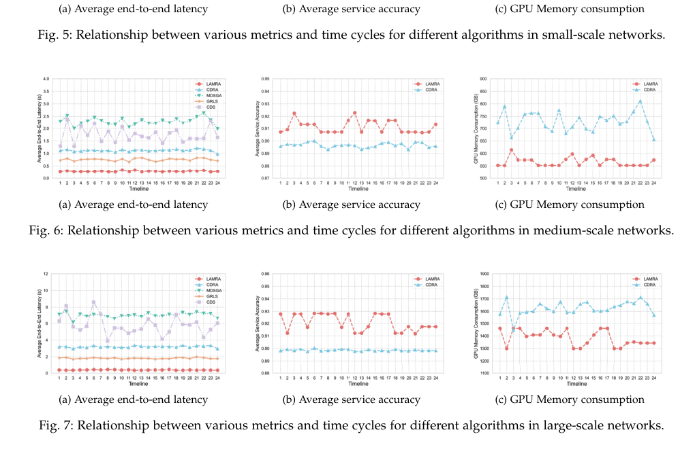
*图 7：大规模网络中不同算法的各项指标随时间周期的变化关系*

在动态场景的小/中/大规模网络中（图 5-7）：
- **小规模**：LAMRA 平均延迟 0.19，比所有基线低 38%，比 MDSGA 低 62.7%；准确率 0.932（比 CDRA 高 2.76%）；GPU 内存 153.1 GB（比 CDRA 低 19.7%）
- **中规模**：LAMRA 延迟 0.27，比 CDRA/MDSGA/GRLS/CDS 分别低 75.9%/88.2%/64.0%/84.5%
- **大规模**：LAMRA 延迟 0.37，比 CDRA/MDSGA/GRLS/CDS 分别低 88.5%/94.7%/79.8%/93.6%

在固定端到端延迟条件下对比 GPU 内存消耗（图 8）：LAMRA 在小规模网络节省超过 55%（最高达 82.5% vs MDSGA），中规模节省 49.3%-75.4%，大规模节省 44.9%-72.9%。这一效率源于 GSTC 在设计阶段嵌入资源感知，从源头消除 GPU 冗余。

---

## 4. 面向不同对象的后续建议

1. **面向入门者**
   标题：从排队论和 NAS 基础入手理解 GSTC 框架
   *核心建议：先掌握 M/M/C 排队模型的基本公式和稳定性条件，再理解信息量化的直觉——"信息随网络深度衰减"这一假设如何转化为具体的编码值；建议复现 GSTC 在 NAS-Bench-201 上的相关性实验，亲手计算几个架构的 G/S/T/C 四维度分数。*
   数学推导难度：中

2. **面向硕博学生**
   标题：将 GSTC 框架扩展至 Transformer 架构和大模型服务部署
   *核心建议：GSTC 当前面向 CNN 架构（NASBench-101/201），其核心假设——有效信息随深度指数衰减——在 Transformer 的自注意力和前馈网络中是否依然成立？值得探索基于注意力图稀疏度或激活范数的信息量化编码，将 GSTC 推广到 LLM 服务部署场景，结合 KV Cache 管理和流水线并行设计新的零成本代理。*
   数学推导难度：高

3. **面向教授**
   标题：指导学生从理论边界分析走向系统实现
   *核心建议：本论文的 Theorem 1-3 和拉格朗日对偶分析为学生提供了扎实的理论训练素材。建议要求学生：（1）在简化场景（单服务器、两种服务）下手工推导 KKT 条件；（2）用 Python 实现一个最小可运行的 GSTC-JCQDA-LAMRA 原型，在合成负载下验证定理结论；（3）思考 Slater 条件在异构硬件场景下是否依然成立——这是将理论成果推向实际系统时必须回答的工程问题。*
   数学推导难度：很高

---

## 5. 总结与评价

本文首次提出了面向 AI 服务全生命周期的协同优化框架 GSTC-JCQDA-LAMRA，将神经网络架构设计与动态部署执行紧密耦合。GSTC 通过信息量化的量化编码机制实现了无需训练的架构评估，在多个数据集和任务上的相关性指标超越主流代理；JCQDA 基于 M/M/C 排队理论和服务-服务器亲和机制实现了低延迟静态部署；LAMRA 通过 Pareto 前沿选择和加权评分实现了负载感知的动态模型替换。

理论分析严格证明了联合优化在资源利用率上界、延迟下界和服务质量上界三个维度均严格优于仅优化部署和路由的基线，且对偶间隙更窄，实际性能更接近理论最优。实验验证了框架在小、中、大规模网络中的有效性，尤其在动态负载波动下表现突出。

该框架的局限性在于：当前主要面向同构服务器集群和 CNN 架构，未来可扩展至异构硬件、Transformer/LLM 服务以及多模态 AI 服务场景。此外，GSTC 的编码假设——有效信息随深度指数衰减——在 ResNet 风格的 CNN 中较为合理，但在具有跳跃连接和复杂拓扑的架构中可能需要修正。
