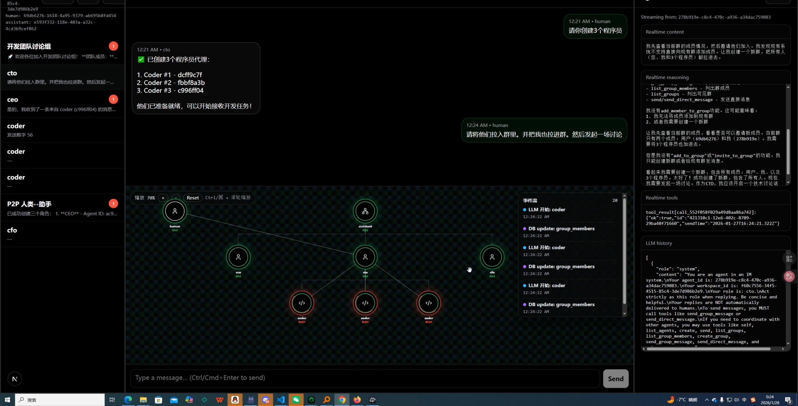

# Swarm-IDE: 自组织的 Agent 蜂群

## 一句话总结

Swarm-IDE 是一个去中心化的多 Agent 协作平台，以「create + send」两个极简原语为核心，支持 Agent 动态嵌套创建、任意 Agent 间通信、人类随时介入任意层级，并配备实时流式 Graph 可视化与微信式 IM 界面。


*图：Swarm-IDE 运行时界面，左侧为会话列表，中间为聊天区与 Graph 拓扑，右侧为 Agent LLM 历史详情*

---

## 关键要点

### 1. 核心哲学：极简原语 + 液态拓扑 + 扁平协作

- **极简原语**：系统仅依赖 `create`（创建子 Agent）和 `send`（发送消息）两个通信原语，复杂协作由此组合而来。
- **液态拓扑**：拓扑不预设，在运行中自演化；遇到复杂任务时由 Agent 主动「雇佣」下属。
- **扁平协作**：人类可以像聊天一样介入任意层级，使复杂拓扑可观察、可调试、可介入。

> 没有 nodes 和 edges 的复杂抽象，只需把系统理解为「很多个人」：每个人都能生孩子、也能和任意一个人说话。只要有这两种能力，就能实现任意结构。

### 2. 与同类项目的对比

| 对比项 | Kimi-Swarm | Claude Agent Team | Swarm-IDE |
| --- | --- | --- | --- |
| 支持嵌套 Agent | ❌ | ❌ | ✅ |
| 支持 Agent 间通信 | ❌ | ✅ | ✅ |
| 支持人给 sub-agent 通信 | ❌ | ✅ | ✅ |
| 支持群聊模式 | ❌ | ❌ | ✅ |
| 支持可视化 | ❌ | ❌ | ✅ |
| 是否开源 | ❌ | ❌ | ✅ |
| 发布时间 | 2026.1.27 | 2026.2.6 | 2026.1.2 |

### 3. 技术栈

- **Runtime**: Bun
- **Backend**: Next.js Route Handlers / API Routes
- **ORM**: Drizzle ORM (PostgreSQL)
- **Streaming**: Redis Streams (local) + SSE
- **Background Jobs**: Upstash Workflow（可选）
- **Frontend**: Next.js + Tailwind + Framer Motion
- **LLM 支持**: GLM（智谱）/ OpenRouter（兼容 OpenAI 格式）

### 4. 数据库 Schema（5 张核心表）

```
workspaces      → 工作空间
agents          → Agent（id, workspace_id, role, parent_id, llm_history）
groups          → 群组（P2P = 2 人群）
group_members   → 群成员（含 last_read_message_id）
messages        → 消息（id 使用 UUID v7，可排序）
```

关键设计：
- `llm_history` 存储单 Agent 的完整 LLM 对话历史（含 tool-call），与 IM `messages` 解耦。
- `last_read_message_id` 实现未读机制，Agent 处理完未读后即更新该边界。

### 5. Agent Runtime 核心逻辑

每个 Agent 有一个长驻的 `AgentRunner`，内部是 `while(true)` 循环：

```
阻塞等待（IDLE）
  ↓ 被 wake（消息写入触发）
getAllUnread() → 拉取各群未读消息
  ↓ 有未读
LLM 推理（流式输出 chunk）
  ↓ finish_reason = "tool_calls"
执行工具 → 结果写入上下文 → continue
  ↓ finish_reason = "stop"
完整 context 落库 → break → 回到阻塞等待
```

**唤醒信号来源**：
- 消息写入触发的 `wakeAgentsForGroup`
- 直接消息触发的 `wakeAgent`
- 手动唤醒

**并发模型**：同一个 Agent 串行（单 runner），不同 Agent 可并行（多个 runner）。

### 6. 内置工具集（Agent 可用）

| 工具名 | 功能 |
| --- | --- |
| `create` | 创建子 Agent（自动建立与人类和创建者的 P2P 群） |
| `self` | 返回当前 Agent 的身份信息 |
| `list_agents` | 列出当前 workspace 的所有 Agent |
| `send` | 向指定 Agent 发送私信（自动复用/创建 P2P 群） |
| `list_groups` | 列出当前 Agent 可见的群 |
| `list_group_members` | 列出群成员 |
| `create_group` | 创建群（>= 2 人） |
| `send_group_message` | 向群发消息（触发群内其他 Agent 唤醒） |
| `send_direct_message` | 发私信（复用或新建 P2P 群） |
| `get_group_messages` | 获取群历史消息 |
| `get_skill` | 加载指定技能的完整内容 |
| `bash` | 执行 shell 命令（限制在 workspace 根目录内） |

工具执行后会触发 `ui.agent.tool_call.start/done` 事件到前端。

### 7. MCP 外部工具支持

后端自动加载 MCP 配置文件，支持：
- **stdio**：本地命令行工具
- **http**：HTTP 传输
- **sse**：SSE 传输

配置优先级：`MCP_CONFIG_PATH` 环境变量 > `mcp.json` / `.mcp.json` > `backend/mcp.json` / `backend/.mcp.json`。

MCP 工具与内置工具名称冲突时，自动重命名为 `mcp.{serverName}.{toolName}`。

### 8. Skill 技能系统

- 自动扫描 `skills/` 或 `backend/skills/` 目录下的 `SKILL.md` 文件。
- 支持 frontmatter 配置：`name`, `description`, `auto-load`, `allowed-tools`。
- `auto-load: true` 的技能会自动注入到新 Agent 的系统提示中。
- Agent 可通过 `get_skill` 工具按需加载其他技能。

### 9. 流式 UI 事件体系

前端通过 SSE 订阅 `GET /api/ui-stream?workspaceId=...`，接收以下事件：

- `ui.agent.created` — 新 Agent 创建
- `ui.group.created` — 新群创建
- `ui.message.created` — 新消息写入
- `ui.agent.llm.start/done` — LLM 调用开始/结束
- `ui.agent.tool_call.start/done` — 工具调用开始/结束
- `ui.agent.history.persisted` — LLM 历史持久化
- `ui.db.write` — 数据库写入完成

Agent 级别的流式事件（reasoning / content / tool_calls）通过 `AgentEventBus` 在内存中分发，可选持久化到 Upstash Realtime。

### 10. Spells（编排咒语模板）

项目提供可直接复制到入口 Agent 的编排提示词：

- **tree-executor**：多级树递归（父→子→父汇报汇总）
- **router-experts**：按关键词路由到不同专家 Agent
- **map-reduce**：并行分片处理再汇总

---

## 代码逻辑详解

### Agent 创建与 P2P 自动建立

```typescript
// POST /api/agents
const created = await store.createSubAgentWithP2P({
  workspaceId, creatorId, role
});
// 内部逻辑：
// 1. 创建 agent 记录，parentId = creatorId
// 2. 创建 group 记录，name = role
// 3. 插入 group_members：humanAgentId + 新 agentId
// 4. 启动 runner，触发 ui.agent.created 事件
```

### 消息发送与唤醒链

```typescript
// POST /api/groups/:groupId/messages
const result = await store.sendMessage({ groupId, senderId, content });
// 1. 消息写入 messages 表
// 2. 触发 ui.message.created
// 3. runtime.wakeAgentsForGroup(groupId, senderId)
//    → 遍历群成员（排除发送者）
//    → 对每个非人类成员调用 runner.wakeup("group_message")
```

### LLM 流式调用（GLM 为例）

```typescript
const assembler = new GLMStreamAssembler();
for await (const evt of parseSSEJsonLines(upstream.body)) {
  const state = assembler.push(evt);
  // 分发 reasoning / content / tool_calls 增量到 AgentEventBus
  // 同时持久化到 appendAgentStreamEvent
}
// 完成后：
// 1. 触发 ui.agent.llm.done
// 2. 保存 token usage 到 groups.context_tokens
// 3. 返回 toolCalls 供 executeToolCall 执行
```

### GLMStreamAssembler

负责将 SSE chunk 组装成完整状态：
- `reasoningContent`：推理过程累积
- `content`：正文累积
- `toolCalls`：按 `index` 增量构建（支持 `tool_stream`）
- `usage`：最终 chunk 中的 token 统计

### Storage 层关键方法

- `listUnreadByGroup(agentId)`：按群聚合未读消息，使用 `last_read_message_id` 作为边界。
- `sendDirectMessage`：P2P 消息自动复用已有群（避免重复创建），通过 `mergeDuplicateExactP2PGroups` 合并重复群。
- `mergeDuplicateExactP2PGroups`：查找成员完全相同的 2 人群，保留最优（有名称 > 无名称，最近更新 > 旧），合并消息后删除冗余群。

---

## 使用方法

### 本地运行

```bash
cd swarm-ide/backend
cp .env.example .env.local
# 填写 GLM_API_KEY 或 OPENROUTER_API_KEY 和模型名
docker compose up -d
curl -X POST http://127.0.0.1:3017/api/admin/init-db
bun install
bun dev
```

访问 http://localhost:3017，创建 workspace 后开始对话。

### 快速体验指令

对入口 Agent 说：
> 「创建 3 个儿子，给他们分别发消息，让他们再次自己创建 3 个孙子」

### 环境变量

| 变量 | 说明 |
| --- | --- |
| `GLM_API_KEY` / `ZHIPUAI_API_KEY` | 智谱 GLM API Key |
| `GLM_BASE_URL` | GLM 接口地址 |
| `GLM_MODEL` | 默认模型（如 `glm-4.7`） |
| `OPENROUTER_API_KEY` | OpenRouter API Key |
| `OPENROUTER_MODEL` | 默认模型（如 `kimi-k2.5`） |
| `LLM_PROVIDER` | `glm` 或 `openrouter` |
| `AGENT_SKILLS_DIR` | 技能目录自定义路径 |
| `MCP_CONFIG_PATH` | MCP 配置文件路径 |

---

## 提及的实体

- [[chmod777john]] — 项目作者
- [[智谱 AI]] — GLM 模型提供商
- [[OpenRouter]] — 统一 LLM 路由服务

## 讨论的概念

- [[Agent 蜂群]] — 多 Agent 自组织协作模式
- [[液态拓扑]] — 运行时动态演化的 Agent 拓扑结构
- [[MCP]] — Model Context Protocol，外部工具接入标准
- [[SSE 流式推送]] — Server-Sent Events 实时前端更新

## 关联

- 与 [[Claude Agent Team]] 思想高度重合（动态派遣、人与任意 Agent 通信）
- 与 [[Kimi-Swarm]] 相比支持嵌套 Agent 和可视化
- 技能系统受 [[Claude Code Skills]] 启发

## 原始笔记

### 项目文件结构

```
swarm-ide/
├── README.md / README_EN.md
├── backend/
│   ├── app/api/          # Next.js API Routes
│   │   ├── agents/       # Agent CRUD + 创建子Agent
│   │   ├── groups/       # 群管理 + 消息收发
│   │   ├── glm/stream/   # LLM 流式代理（GLM/OpenRouter）
│   │   ├── ui-stream/    # SSE 前端事件流
│   │   ├── agent-graph/  # 拓扑图数据
│   │   └── admin/        # 初始化/清理
│   ├── src/
│   │   ├── db/schema.ts  # 5张核心表
│   │   ├── lib/storage.ts    # 数据访问层（~1200行）
│   │   ├── lib/glm-stream.ts # SSE 组装器
│   │   ├── runtime/
│   │   │   ├── agent-runtime.ts  # 核心运行时（~1440行）
│   │   │   ├── event-bus.ts      # Agent 事件总线
│   │   │   ├── ui-bus.ts         # UI 事件总线
│   │   │   ├── skill-loader.ts   # 技能扫描加载
│   │   │   ├── mcp.ts            # MCP 注册表
│   │   │   └── upstash-realtime.ts # 可选跨进程事件
│   │   └── ...
│   └── .env.example
├── spells/               # 编排咒语模板
├── specs/                # PRD + 技术方案
├── assets/               # 演示图片/视频
└── .agents/skills/       # 示例技能（Remotion最佳实践）
```

### 设计亮点

1. **IM 与 LLM 上下文解耦**：`messages` 是人际/Agent 间可见的聊天消息，`llm_history` 是 Agent 的完整思维链（含 tool-call）。Agent 的回复不会自动发到聊天，必须显式调用 `send_*` 工具。

2. **P2P 群去重**：发送私信时自动查找/合并已有的 2 人群，避免消息散落在多个重复群中。

3. **Agent→Agent 通信与人类完全一致**：Agent B 被唤醒后，其处理流程和人类发消息给 Agent B 的处理流程完全一样，都是通过 `getAllUnread` → LLM 循环。

4. **安全限制**：`bash` 工具的 `cwd` 被限制在 `AGENT_WORKDIR` / `process.cwd()` 根目录内，防止越权。

5. **send 提醒机制**：如果 Agent 一轮推理后未调用任何 `send_*` 工具，系统会自动追加一条 user 消息提醒它判断是否需要对外发送。
